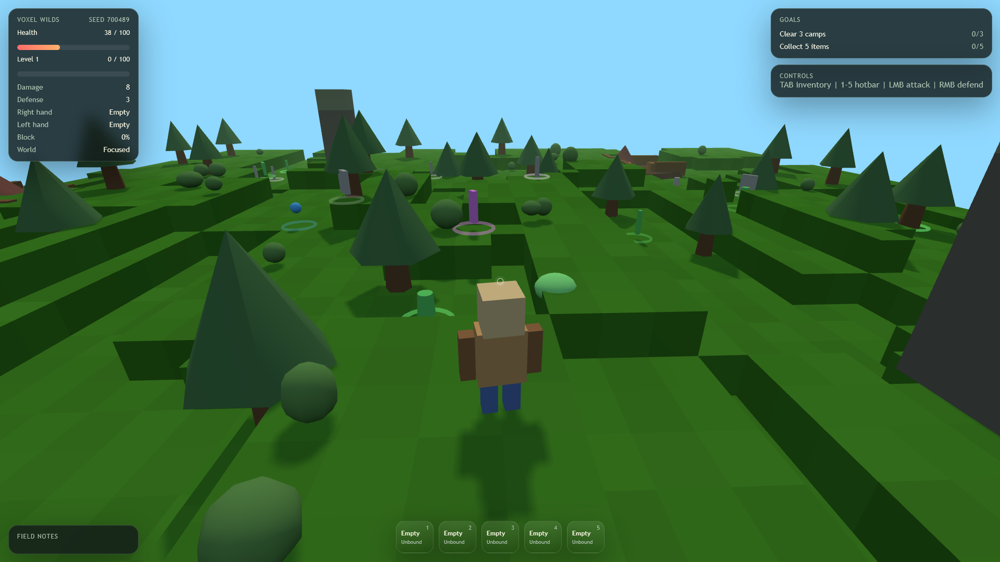
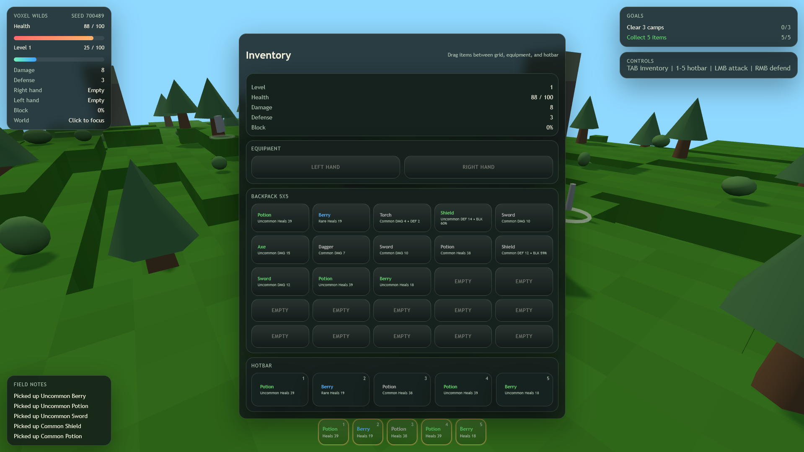
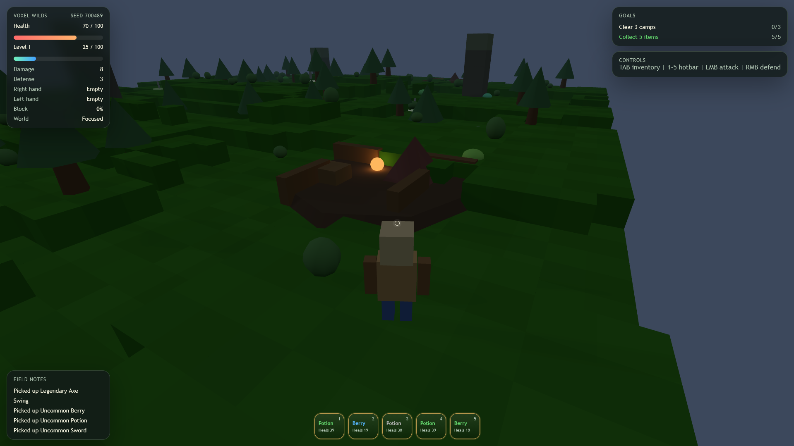
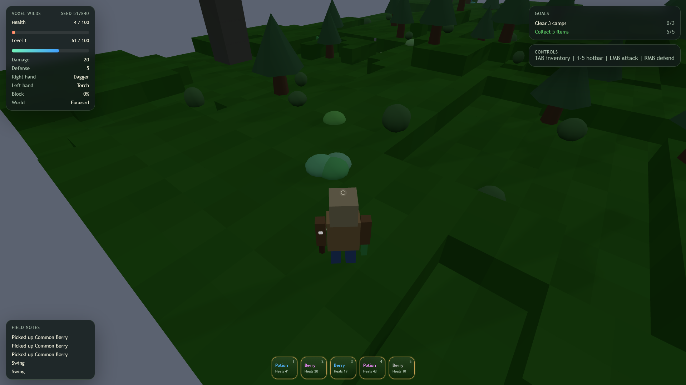
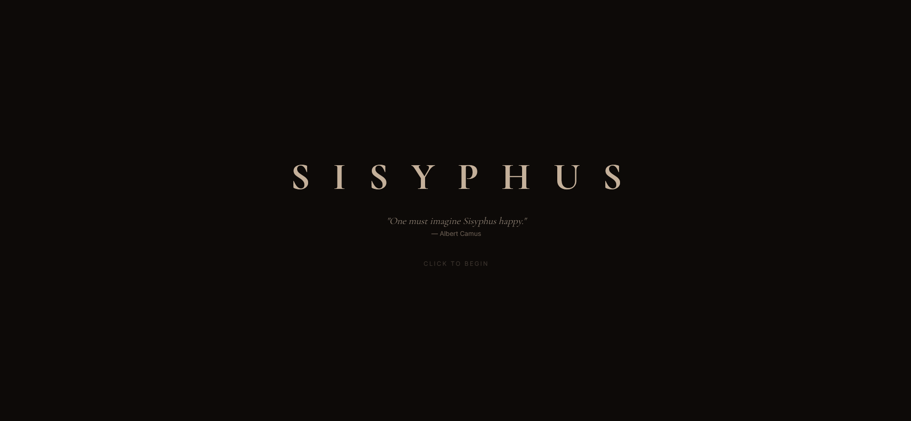
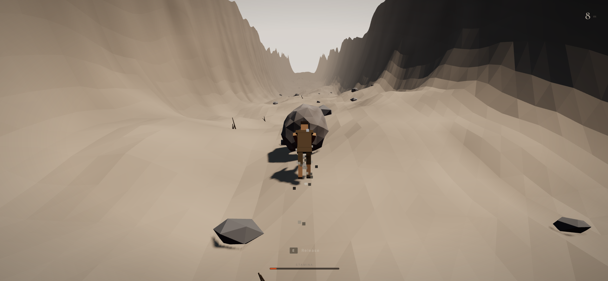
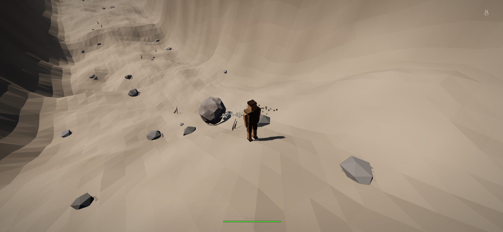

<div align="center">
  <h1>VibedGames</h1>
  <p>Fully vibe coded web games used as pseudo benchmarks of whatever "latest world's most powerful model" is at the moment</p>
</div>

## Disclaimer

**This is a sarcastic project**. The "benchmark" aspect has **zero scientific validity or value**. These are 4fun games that are fully built by AI. If you're looking for actual LLM benchmarks, please look elsewhere. 

Again, **this is a satire**.

See [Contributing](#Contributing)

## Tech Stack

- **Three.js** - 3D graphics
- **Vite** - Build tool and dev server
- **Vanilla JavaScript or TypeScript** - No frameworks

## About

This repository contains a collection of web games that are entirely "vibe coded" - meaning they're fully built by prompting AI coding assistants, no human written code.

Each game folder contains a `prompt.md` file with the prompts used to generate the game.

The purpose is to:
- Experiment with AI-assisted game development
- See what different AI models can build when given creative freedom
- Definitely not create an actual game, please don't.


## Preview

<div align="center">
  <details open>
    <summary><b>voxel-rpg</b></summary>
    <br>
    <table>
      <tr>
        <td colspan="3" align="center"></td>
      </tr>
      <tr>
        <td></td>
        <td></td>
        <td></td>
      </tr>
    </table>
  </details>
  <details open>
    <summary><b>sisyphus</b></summary>
    <br>
    <table>
      <tr>
        <td colspan="3" align="center"></td>
      </tr>
      <tr>
        <td></td>
        <td></td>
      </tr>
    </table>
  </details>
</div>
</div>

## Games

Each game is in its own folder with independent configuration:

<table>
  <thead>
    <tr>
      <th>Game</th>
      <th>Description</th>
      <th>Model(s)</th>
      <th>MCPs</th>
      <th>Skills</th>
    </tr>
  </thead>
  <tbody>
    <tr>
      <td><code>voxel-rpg</code></td>
      <td>A voxel-based RPG with combat, inventory, and questing</td>
      <td>GPT 5.4</td>
      <td><em>TBD</em></td>
      <td><em>TBD</em></td>
    </tr>
    <tr>
      <td><code>sisyphus</code></td>
      <td>A Sisyphus boulder-pushing game with procedural terrain and physics</td>
      <td>Claude Opus 4.6</td>
      <td><em>TBD</em></td>
      <td><em>TBD</em></td>
    </tr>
  </tbody>
</table>

## Contributing

See the [Contributing Guidelines](CONTRIBUTING.md) for details on how to contribute to this project.

Feel free to add your own vibe coded games or improve existing ones. All contributions must be **fully generated by AI** with no human-written code allowed.

New games must include a `prompt.md` file detailing the initial prompt used to generate the game. 

**Contributions must include a `prompt_history.md`** showing the iterative process of refining the prompts to achieve the final result.


## Setup

Install dependencies:

```bash
npm install
```

### Running Games

Each game has its own dev, build, and preview scripts:


```bash
# Run voxel-rpg
npm run dev:voxel-rpg

# Run sisyphus
npm run dev:sisyphus

# Future games will follow the pattern:
# npm run dev:game-name
```

The dev server will start at the configured port. See each game's `vite.config.js` for details.


## License

MIT - Do whatever you want with this code. 

## Credits

Games created by AI - specific models listed in each game's section above.

Contributors go here.
